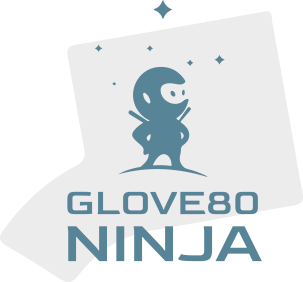

# Glove80 Ninja 🥷⌨️
*A touch typing tutor for the Glove80 keyboard*

Glove80 Ninja is a typing tutor inspired by Keybr.com, but built specifically for **Glove80 ergonomic keyboard users**.\
It supports **default layouts** (QWERTY, Dvorak, Colemak, Glove80 default) as well as **custom layouts**, so you can practice your exact keymap.

## 🚀 MVP Scope (`v0.1.0`)

The goal of the first release is a **Minimum Viable Product** (MVP).\
It should allow a Glove80 user to:
- Practice typing text with live WPM & accuracy feedback.
- Import and use a custom keyboard layout.
- Choose from built-in layouts (QWERTY, Dvorak, Colemak, Glove80 default).
- Save/load user configuration and progress locally.
- Train with a lesson system that adapts to the chosen layout.

## 📌 Roadmap

Current milestone: **`v0.1.0 - MVP`**
- [ ] Core typing practice engine
- [ ] Default layouts support
- [ ] Custom layout import
- [ ] User configuration system
- [ ] Practice system (lesson generator)
- [ ] Basic UI & navigation
- [ ] Persistence layer

Future ideas (post-MVP):
- Progress analytics (graphs, heatmaps, streaks)
- Themes & custom styling
